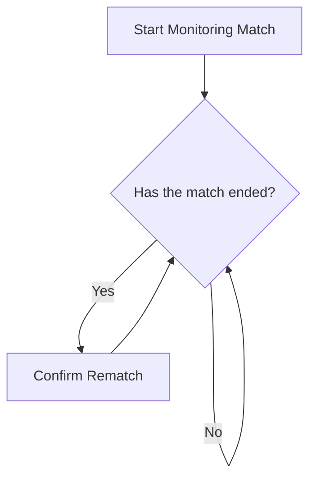

<h1 align="center">
  INAZUMA ELEVEN: Victory Road — Macro
</h1>

<p align="center">
  <a href="#" target="blank">
    
  </a>
</p>

<p align="center">
    A macro for Inazuma Eleven: Victory Road that automates farming in Chronicle Mode, executing repetitive in-game actions to streamline progression without manual input. 
</p>

## ⚽ About the project
This project is a Python automation tool built to assist with repetitive farming tasks in Inazuma Eleven: Victory Road, focusing on Chronicle Mode progression ⚽🤖. Instead of manually repeating the same in-game routines, the script is designed to handle these actions in a consistent and structured way, helping to streamline gameplay and reduce the time required for grinding ⏱️.

The project was also developed as a practical learning experience 📚. It served as an opportunity to strengthen my Python development skills while experimenting with automation concepts in a real-world context. In addition, it provided hands-on practice with the TUF framework and GitHub Actions ⚙️, allowing me to explore how automation and CI/CD pipelines can be integrated into a personal project workflow 🔧.

Overall, this repository combines game automation with software development learning goals 🎯, aiming to improve both technical proficiency and understanding of modern development tooling.

<br>

## 🔨 Usage
The macro can be executed using the following base command:
```bash
ie-vr-macro.exe macro match
```
This command initiates the automation flow for matches in *Inazuma Eleven: Victory Road* while operating in Commander Mode.

Once executed, the macro enters a monitoring state, waiting for the current match to conclude.

Upon detecting the end of the match, it automatically confirms the rematch option, allowing the next match cycle to begin without manual intervention.



### Optional Arguments
### `--input`
Defines the input method used by the macro.

- Options: `desktop` (keyboard and mouse), `gamepad` (virtual gamepad)
- Default: `desktop`

**Example:**
```bash
ie-vr-macro.exe macro match --input gamepad
```

### `--max-loops`
Sets the maximum number of match cycles the macro will execute before stopping.

- Type: `INTEGER`
- Default: infinite (no limit)

**Example:**
```bash
ie-vr-macro.exe macro match --max-loops 50
```

### `--log`
Enables file logging for execution tracking and debugging purposes.

- Type: flag (no value required)
- Default: disabled

**Example:**
```bash
ie-vr-macro.exe macro match --log
```

<br>

## 💻 Built with
- [Python 3.10.9][python]

<br>

## 🤩 Getting started
If you want the project for development, some prerequisites are necessary.

### Prerequisites (Windows)
* Python
  1. You can download here: [Python][python_url]
  2. Here is a step-by-step tutorial. [(Tutorial)][python_tutorial_url]
     1. Tutorial with Miniconda. [(Tutorial)][miniconda_tutorial]
* Poetry
  1. You can install here: [Poetry][poetry_url]

### Installation and Usage
1. Clone the repository.
    ```sh
    git clone https://github.com/Arekushi/inazuma-eleven-victory-road-macro.git
    ```

2. Install packages with `Poetry`
    ```sh
    poetry install
    ```

3. Run:
    ```sh
    python main.py --help
    ```

4. That's it, you can start developing 🎉

### Variables in `.toml` files
I store a lot of information in `.toml` files inside the [`config/toml`][configtoml] directory. If you’d like to customize the application, I highly recommend checking it out!

<br>

## 🗺️ Roadmap
- [x] Automate Chronicle Mode and Free Match
- [ ] Display match insights in the terminal (e.g., average match duration, number of goals, performance statistics)
- [ ] Linux compatibility (X11, Wayland, XWayland support)
- [ ] Online match automation (Commander Mode)
- [ ] Support for multi-team match automation

<br>

## ☕ Contributors
| [<div><br><sub>Alexandre Ferreira de Lima</sub></div>][arekushi] <div title="Code">💻</div> |
| :---: |


<!-- [Build With] -->
[python]: https://www.python.org/downloads/

<!-- [Some links] -->
[python_url]: https://www.python.org/downloads/
[python_tutorial_url]: https://www.digitalocean.com/community/tutorials/install-python-windows-10
[miniconda_tutorial]: https://katiekodes.com/setup-python-windows-miniconda/
[poetry_url]: https://python-poetry.org/docs/#installation
[configtoml]: https://github.com/Arekushi/inazuma-eleven-victory-road-macro/tree/main/config/toml

<!-- [Constributors] -->
[arekushi]: https://github.com/Arekushi
